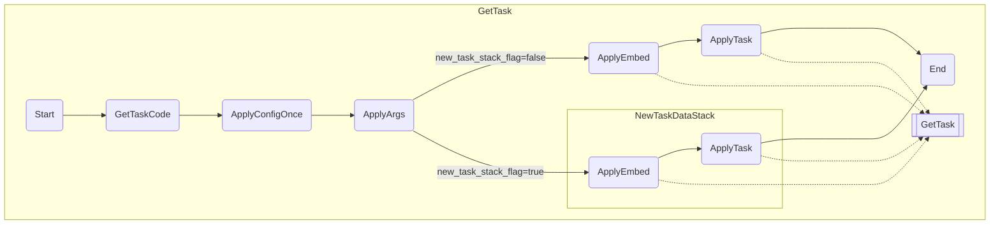

# mdtk structure

markdownのコードブロックで完結するタスクランナー

内部的には動的にシェルスクリプトを構築して実行しているだけ
```bash
cat - << 'EOS' | bash
# ここにタスクを埋め込み
EOS
```

## コードブロック基本構造

````
```task::<taskname>
...
```

```task:<group>:<taskname>  <description>
...
```
````

- `_`から始まる2文字以上のグループはPrivate Group(直接実行できない)として扱う
    - helpからも見えなくする

## 特殊コメント

- `#xxxx> yyyy` の形式
    - `#embed> group:taskname`
        - 別のタスクをそのまま埋め込む
            - cのincludeに近い
        - groupは省略可能: `#task> taskname`
    - `#task> group:taskname -- arg=value...`
        - サブシェルでタスクを実行する
        - groupは省略可能
        - argsの設定もできるが、最初の起動時の設定と微妙に挙動が異なるので注意
            - 起動時は強制的に`""`で囲われる(os.Argsに入った時点でつけたクォートが剥がされているため、スペースが入るとうまく読み込めない)
            - `#task>`の場合は`""`で囲われない
        - 最初に`@`を入れるとconfig-onceの状態が一時的にリセットされる
            - `#task> @ group:taskname -- arg=value...`
    - `#config> once`
        - 1回だけ読み込まれるようにする
    - `#args> xxxx`
        - 必要な変数の記述
        - helpで表示されるだけ

## 予約語

- groupname
    - `_`: 明示的に無名グループを指定する
        - 無名グループとそれ以外のグループの間でタスク名が衝突した際に使用
        - 無名グループ内での衝突は回避できない
- taskname
    - `default`: タスク名なしでコマンドを実行したときに実行されるタスク
        - コードブロックで定義しておく
            - `task::default`
        - `#embed>`などで別のタスクを呼び出すのがいい
        - 明示的に定義されていなければhelpを呼び出す
        - helpで表示されない


## XXX

```bash
# start
cat - << 'EOS' | bash
#config> once?
# args="are_here";

# inner
EOS


# embed
# ===
#config> once?

# inner
# ===


# task
(
#config> once?
# args=are_here;

# inner
)

```


